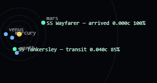

# Honorverse Simulator (`hvsim`)

A space-travel simulator set in David Weber's *Honorverse*. The core value is
**realism of the clock**: ships take real wall-clock hours, days, and weeks to
reach their destinations, and the service reports where everything is *right
now* — evaluated analytically at the queried timestamp, with no game loop and
no drift. It is deliberately not fast or flashy.



*The live Sol map (`GET /`): ships labelled with phase, speed (fraction of c),
and percent-complete, dead-reckoned smoothly between polls.*

## Status

Early development. Phase 1 (the in-system Sol ship simulator) is being built
sprint by sprint.

- Design: [`planning/004-project-plan.md`](planning/004-project-plan.md) is the
  authoritative plan. (`001`–`003` are earlier exploratory transcripts.)
- Execution: [`sprints/`](sprints/) — one short spec + task list per sprint.

## Toolchain

- Python 3.12+, managed with [`uv`](https://docs.astral.sh/uv/).
- [`ruff`](https://docs.astral.sh/ruff/) for lint/format, `pytest` for tests.

```sh
uv sync              # create the env and install dev dependencies
uv run pytest        # run the test suite
uv run ruff check .  # lint
```

## Layout

```
src/hvsim/
  ephemeris/   analytic planet/body positions (Keplerian elements)
  kinematics/  closed-form trajectory math
  flightplan/  compile flight plans into absolute-time segments
  clock/       SimClock — the only time source
  api/         FastAPI service (added in a later sprint)
tests/         pytest suite
```

## Running the service

The service listens on port **4667** ("HONR"). Opening the root URL
(`http://localhost:4667/`) shows a live 2D top-down **Sol map** — bodies and
ships in real time, polling the API. API docs are at `/docs`.

```sh
# Local (dev): enable the clock controls so you can fast-forward a multi-hour trip.
HVSIM_DEV_CLOCK=1 uv run uvicorn --factory hvsim.api.app:create_app --reload --port 4667

# Or in Docker (maps host 4667 → container 8000):
docker compose up --build      # serves on http://localhost:4667
```

The canonical merchant run over HTTP — Earth → Titan Station (6 h) → Earth:

```sh
# 1. Create the ship.
SHIP=$(curl -s -X POST localhost:4667/ships \
  -H 'content-type: application/json' \
  -d '{"name":"SS Harrington","max_accel_g":250,"max_velocity_c":0.6}' | jq -r .id)

# 2. File the flight plan (6h layover = 21600s).
curl -s -X POST localhost:4667/ships/$SHIP/flightplan \
  -H 'content-type: application/json' \
  -d '{"waypoints":[{"body":"titan-station","layover_seconds":21600},{"body":"earth"}]}' | jq

# 3. Ask where it is right now.
curl -s localhost:4667/ships/$SHIP/state | jq

# 4. Where is everything? (dashboard map)
curl -s localhost:4667/bodies | jq
```

With `HVSIM_DEV_CLOCK=1` you can fast-forward: `PUT /clock` with
`{"rate": 3600}` (1 real second = 1 sim hour) or `{"jump_to": "<iso8601>"}`.
Interactive API docs are at `/docs`.

## Deploying

Deploy is driven by [`just`](https://just.systems) from this machine (`just` to
list recipes). The default target is `kubsdb` at port 4667, running **real time**
with the clock locked (no dev controls).

```sh
just deploy   # build image -> ship to kubsdb (docker save | ssh load) -> compose up -> health
just health   # curl the deployed /health and /clock
just seed     # file a few experimental "XSS" demo ships (100 g transport .. 700 g courier)
just logs     # tail the deployed logs
just down     # stop/remove the stack (the SQLite volume is preserved)
```

Image delivery is registry-free (`docker save | ssh kubsdb docker load`); a move
to ghcr is tracked for later. SQLite lives on a named volume and the container
is `restart: unless-stopped`, so flight plans survive restarts and host reboots.

## License

[MIT](LICENSE)
